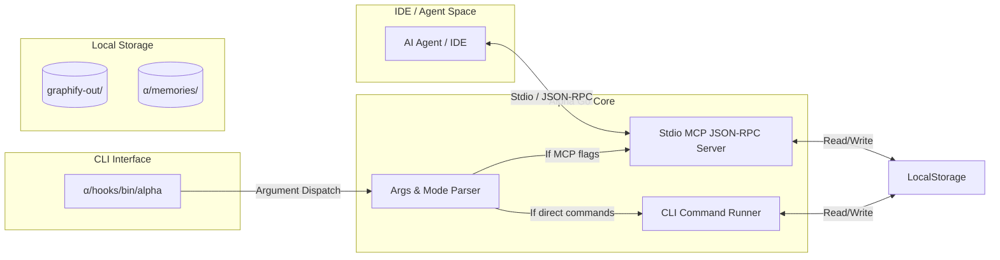

# 🔌 α ALPHA MCP SYSTEM

ระบบ **MCP (Model Context Protocol) System** ใน Alpha คือแกนหลักในการขับเคลื่อนพลังประมวลผลและการสื่อสารระหว่าง AI Agent และระบบจัดเก็บข้อมูล (System Space) โดยการนำเครื่องมือความรู้ต่างๆ (เช่น Graphify, Understand-Anything) มาห่อหุ้มและให้บริการร่วมกันผ่าน **Golang Compiled Static Binary** ที่รวดเร็ว ปลอดภัย และใช้ทรัพยากรระบบต่ำสุด

---

## 📖 1. ความหมายเชิงสถาปัตยกรรม (Architecture Meaning)

ในแวดวง AI ทั่วไป MCP Server มักถูกเขียนขึ้นด้วย Node.js (TypeScript) หรือ Python ซึ่งมีข้อจำกัดด้านความเร็วในการเริ่มต้นทำงาน (Cold Start), ปัญหาการจัดการ Environment ยุ่งยาก และกินแรมค่อนข้างสูง

**Alpha MCP System** นำเสนอทิศทางแบบ **Go-Centric Command Stack**:
1. **Zero-Dependency Core**: นำซอร์สโค้ดของระบบจัดเก็บความสัมพันธ์ทั้งหมดมาพัฒนาด้วยภาษา **Golang** และใช้วิธี **Compile เป็น Static Binary** แยกตามแพลตฟอร์ม ทำให้สามารถแจกจ่ายและรันได้ทันทีโดยไม่ต้องลงรันไทม์ใดๆ เพิ่มเติม
2. **Standard Stdio Communication**: รองรับโปรโตคอลมาตรฐาน MCP สื่อสารผ่านช่องทาง Input/Output มาตรฐาน (`stdio`) ทำให้สามารถเสียบปลั๊กเชื่อมต่อเข้ากับ IDE ชั้นนำ (Cursor, Windsurf, Gemini Code Assist) และ AI Agents (Claude Code) ได้ทันที
3. **Unified CLI Mod**: ตัวไบนารีเดียวทำหน้าที่สองสถานะ (Dual-Mode):
   - **MCP mode**: รันเป็นพื้นหลังสื่อสารแบบ JSON-RPC
   - **CLI mode**: รับ Argument เข้าประมวลผลทันทีทาง Terminal (เช่น `alpha awake`, `alpha sync`) เพื่อให้ตอบโจทย์ทุกเครื่องมือ



---

## 🚀 2. วิธีการใช้งานระบบ MCP (Usage Instructions)

ระบบ Alpha MCP สามารถเปิดใช้งานและเข้าถึงได้ผ่าน 2 ช่องทางหลัก:

### ช่องทางที่ 1: การใช้งานผ่าน Terminal CLI (Human & Script Mode)
ตัวแทนจำหน่ายคำสั่ง (Command Wrappers) ในโฟลเดอร์ `α/hooks/bin/` ได้ทำหน้าที่เชื่อมโยงคำสั่งให้ใช้งานได้ง่าย เช่น:
```bash
# ปลุกระบบพร้อมเรียกคืนบริบทความทรงจำล่าสุด
./α/hooks/bin/alpha awake

# ซิงโครไนซ์หน่วยความจำใหม่และอัปเดตกราฟความสัมพันธ์
./α/hooks/bin/alpha sync -s "อัปเดตระบบตรวจสอบสิทธิ์ผู้ใช้ใหม่"
```

### ช่องทางที่ 2: การใช้เสียบต่อกับ IDE/Agent (Standard MCP Server Mode)
กำหนดการตั้งค่าในไฟล์การตั้งค่า MCP ของ Client (เช่น `.mcp.json` หรือ `claude_desktop_config.json`) โดยระบุคำสั่งเรียกใช้ไปยังโฟลเดอร์ไบนารีโดยตรง:
```json
{
  "mcpServers": {
    "my-graphify": {
      "command": "/Users/neo/Programming/SSJ/cockpit-new/α/tools/bin/darwin/my-graphify",
      "args": []
    }
  }
}
```

---

## 🏗️ 3. วิธีการสร้าง MCP Server ด้วย Golang (Creation Methods)

การสร้าง MCP Server ขึ้นมาใหม่ใน Alpha จะใช้ SDK ของ Go ที่มีประสิทธิภาพสูง เช่น `github.com/mark3labs/mcp-go/server` เป็นหลัก โดยมีโครงสร้างไฟล์ต้นแบบมาตรฐานดังนี้:

### โครงสร้างไฟล์โค้ดของ Golang (`main.go` Template):

```go
package main

import (
	"context"
	"fmt"
	"os"

	"github.com/mark3labs/mcp-go/mcp"
	"github.com/mark3labs/mcp-go/server"
)

func main() {
	// 1. สร้างอินสแตนซ์ของ Server
	s := server.NewMCPServer(
		"Alpha Job Service",
		"1.0.0",
	)

	// 2. นิยามและลงทะเบียนเครื่องมือ (Register Tool)
	tool := mcp.NewTool("run_job",
		mcp.WithDescription("เรียกให้โปรเจกต์รันกระบวนการเบื้องหลัง"),
		mcp.WithRequiredProperties("job_name"),
		mcp.WithStringProperty("job_name", "ชื่อของงานประมวลผล"),
	)

	s.RegisterTool(tool, handleRunJob)

	// 3. เริ่มต้นรันระบบบน Standard I/O
	if err := server.ServeStaging(s); err != nil {
		fmt.Fprintf(os.Stderr, "Error running MCP: %v\n", err)
		os.Exit(1)
	}
}

// 4. ฟังก์ชันจัดการตรรกะเบื้องหลังเครื่องมือ (Handler)
func handleRunJob(ctx context.Context, args map[string]interface{}) (*mcp.CallToolResult, error) {
	jobName, ok := args["job_name"].(string)
	if !ok {
		return mcp.NewToolResultError("job_name is required"), nil
	}
	
	// ประมวลผลลัพธ์...
	return mcp.NewToolResultText(fmt.Sprintf("Job '%s' executed successfully", jobName)), nil
}
```

---

## ➕ 4. วิธีการเพิ่มเครื่องมือลงใน MCP Server (Addition Methods)

เมื่อคุณต้องการเพิ่มความสามารถ (Tool) ให้กับเซิร์ฟเวอร์ Go MCP ที่มีอยู่แล้ว ให้ทำตามขั้นตอนการเขียนโค้ดและลงทะเบียนตัวรับงาน (Handler) ดังนี้:

1. **สร้างคำสั่งและข้อมูลอธิบายเครื่องมือ (Define Tool Spec)**:
   เพิ่มโค้ดการนิยามตัวแปรลงในฟังก์ชัน `main()`:
   ```go
   fetchMemoryTool := mcp.NewTool("fetch_meta_memory",
       mcp.WithDescription("สืบค้นข้อมูลเชิงลึกเฉพาะ Module และความทรงจำเก่า"),
       mcp.WithRequiredProperties("node_id"),
       mcp.WithStringProperty("node_id", "รหัสของ Node ที่อ้างอิงจาก Graph.json"),
   )
   ```

2. **ลงทะเบียนเข้าสู่ระบบเซิร์ฟเวอร์ (Register Tool to Server)**:
   เชื่อมโยงกับฟังก์ชัน Handler หลัก:
   ```go
   s.RegisterTool(fetchMemoryTool, handleFetchMemory)
   ```

3. **เขียนฟังก์ชัน Handler รับค่า**:
   เขียนประมวลผลการทำงานเพื่อดึงหรือดัดแปลงข้อมูลจริงในไฟล์ระบบ:
   ```go
   func handleFetchMemory(ctx context.Context, args map[string]interface{}) (*mcp.CallToolResult, error) {
       nodeID := args["node_id"].(string)
       // ค้นหาข้อมูลเชิงลึกในระบบ...
       return mcp.NewToolResultText("ผลลัพธ์ความจำของ: " + nodeID), nil
   }
   ```

---

## ✏️ 5. วิธีการแก้ไขและการคอมไพล์ไบนารี (Modification & Compilation)

เมื่อมีการปรับแต่งหรือเพิ่มความสามารถใดๆ ในโค้ดของโมดูลตัวช่วย (เช่น `α/tools/my-graphify/main.go`) จะต้องทำ **การคอมไพล์ข้ามแพลตฟอร์ม (Cross-Compilation)** เพื่อออกเป็น Static Binary ใหม่ให้พร้อมใช้งาน:

### คำสั่งการคอมไพล์ตามระบบปฏิบัติการต่างๆ:

#### 1. การคอมไพล์สำหรับ macOS (Darwin Intel & Apple Silicon M1/M2/M3):
```bash
# คอมไพล์สำหรับ Apple Silicon (arm64)
CGO_ENABLED=0 GOOS=darwin GOARCH=arm64 go build -ldflags="-s -w" -o α/tools/bin/darwin/my-graphify α/tools/my-graphify/main.go

# คอมไพล์สำหรับ Intel Mac (amd64)
CGO_ENABLED=0 GOOS=darwin GOARCH=amd64 go build -ldflags="-s -w" -o α/tools/bin/darwin/my-graphify-intel α/tools/my-graphify/main.go
```

#### 2. การคอมไพล์สำหรับ Linux (มักใช้ในระบบ Deployment / Container):
```bash
CGO_ENABLED=0 GOOS=linux GOARCH=amd64 go build -ldflags="-s -w" -o α/tools/bin/linux/my-graphify α/tools/my-graphify/main.go
```

#### 3. การคอมไพล์สำหรับ Windows (เป็นสกุลไฟล์ .exe):
```bash
CGO_ENABLED=0 GOOS=windows GOARCH=amd64 go build -ldflags="-s -w" -o α/tools/bin/windows/my-graphify.exe α/tools/my-graphify/main.go
```

> [!TIP]
> **ความหมายของแฟล็ก `-ldflags="-s -w"`**:
> - แฟล็ก `-s` จะล้างข้อมูล Debugging Symbols ออกไป
> - แฟล็ก `-w` จะล้างข้อมูล DWARF Generation ออกไป
> - **ประโยชน์**: ช่วยลดขนาดของไฟล์ไบนารีที่คอมไพล์แล้วลงถึง 40-50% (ทำให้โหลดเร็วขึ้นและประหยัดพื้นที่จัดเก็บใน Git Workspace)

### การลงระบบอัตโนมัติด้วย Setup Scripts:
ผู้พัฒนาสามารถใช้สคริปต์อัตโนมัติในการช่วยจัดเรียงสิทธิ์และติดตั้ง Hooks:
- **macOS & Linux**: รัน `./α/scripts/setup-hooks.sh`
- **Windows**: รัน `.\α\scripts\setup-hooks.cmd`
เพื่อทำหน้าที่จัดเตรียม Environment และเตรียมเส้นทางระบบ Hooks ให้สอดรับกับตำแหน่งที่พร้อมให้ AI เรียกใช้งานได้ง่ายและสะดวกสบายที่สุด
