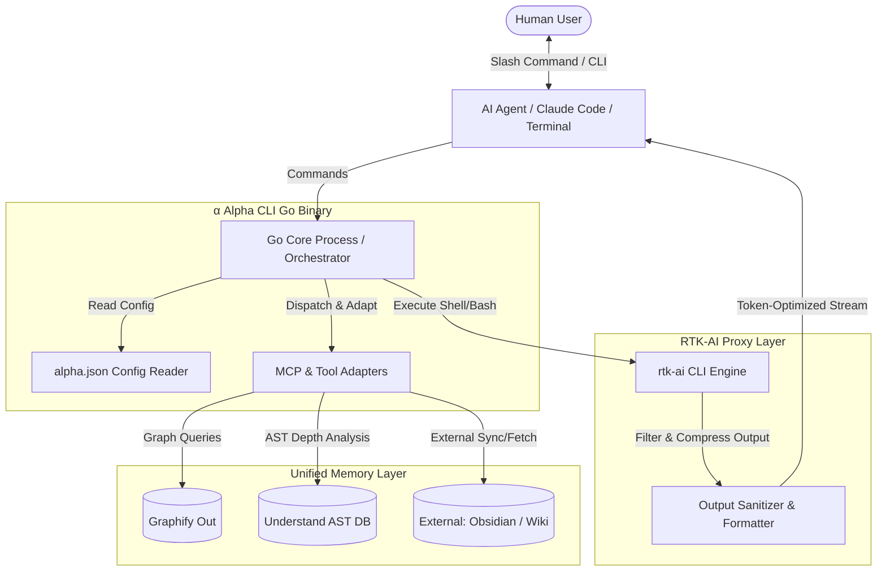

```SH
  █████╗     ██╗         ██████╗     ██╗  ██╗     █████╗ 
 ██╔══██╗    ██║         ██╔══██╗    ██║  ██║    ██╔══██╗
 ███████║    ██║         ██████╔╝    ███████║    ███████║
 ██╔══██║    ██║         ██╔═══╝     ██╔══██║    ██╔══██║
 ██║  ██║    ███████╗    ██║         ██║  ██║    ██║  ██║
 ╚═╝  ╚═╝    ╚══════╝    ╚═╝         ╚═╝  ╚═╝    ╚═╝  ╚═╝
───────────────────────────────────────────────────────────
   A L P H A     A I     S Y S T E M     ( A L P H A )  
─────────────────────────────────────────────────────────── 
Structure -> Meaning    -> Experience   -> Structurization
Knowledge -> Memory     -> Integration  -> Summarization
Token     -> Efficiency -> Optimization -> Minimization
───────────────────────────────────────────────────────────
```

# α ALPHA SYSTEM: สถาปัตยกรรมและการออกแบบระบบ

ระบบ **Alpha** คือ AI-Native Intelligence Toolchain ส่วนบุคคล ที่ออกแบบมาเพื่อเพิ่มประสิทธิภาพการทำงานร่วมกันระหว่างผู้พัฒนา (Human) และ AI Agent โดยเน้น **การจำกัดการใช้ Token ให้ต่ำที่สุด (Token Minimization)**, **การสร้างความเข้าใจในบริบทของโครงสร้างโครงการและความหมายเชิงลึก (Semantic Architecture)** และ **การประมวลผลผ่านระบบที่รวดเร็วและเป็นส่วนตัว (Local-first & Private)**

---

## 🎯 1. เป้าหมายหลักของระบบ (Core Goals)
- **Token Efficiency**: ลดการใช้ Token ลง 50-70% จาก Bash commands, file dumps และ redundant structures
- **Zero Friction Context**: AI เข้าถึงแผนผัง ความสัมพันธ์ และความหมายของโค้ดในโปรเจกต์ได้ทันทีโดยไม่ต้องรันสแกนใหม่ทุกครั้ง
- **Unified Interface**: รวบรวมเครื่องมือหลายแหล่ง (Graphify, Understand-Anything, RTK-AI, Obsidian, Wiki) ให้อยู่ภายใต้ CLI และ Stack เดียวกัน
- **Adaptive Fallbacks**: หากไม่มี API Key สำหรับสกัดข้อมูลความหมาย (Knowledge Extraction) ระบบจะปรับตัวใช้ Local Regex, Visual Nodes (Three.js representation mapping) หรือการสร้าง Sub-Agents เข้าไปจัดการสกัดข้อมูลให้แบบ Adaptive

---

## 🏗️ 2. สถาปัตยกรรมระบบ (System Architecture)

ระบบแบ่งออกเป็น 5 ชั้นประมวลผลหลัก ทำงานร่วมกันอย่างไร้รอยต่อ:



---

## ⚙️ 3. ส่วนประกอบสำคัญของระบบ (Key Components)

### 3.1 Go MCP Core Process (Orchestrator Binary)
- พัฒนาด้วยภาษา **Golang** และคอมไพล์เป็น Static Binary แยกตาม Platform (macOS, Linux, Windows) ไปไว้ที่ `bin/{platform}/alpha`
- ทำหน้าที่เป็น **Orchestrator** รวบรวมและแปลงคำสั่ง MCP จากเครื่องมือภายนอกมารวมไว้ในตัวเดียว
- ทำงานผ่าน JSON Config (`alpha.json`) เพื่อโหลด Module และจัดลำดับการทำงานแบบ Single Command Pipeline

### 3.2 ระบบ SKILL System (Minimalist Indexing)
- ปรับปรุงให้เป็นลักษณะ **Skill Index -> Minimal Detail -> Reference Path** ตามกฎสากลใน `α/rules/skill.md`
- **กลไกการทำงาน**:
  1. AI จะโหลดเฉพาะไฟล์ดัชนีหลัก `α/skills/SKILL.md` (มีขนาดเล็กมากเพียง <200 tokens)
  2. เมื่อ AI พบปัญหาที่ตรงกับทักษะที่เกี่ยวข้อง จะเข้าถึงข้อมูลรายละเอียดแบบเจาะจงผ่าน `reference-path` เท่านั้น
  3. เมื่อทำงานเสร็จ AI จะล้างความจำ (Wipe out Context) เพื่อไม่ให้เกิด Context Bloat ในเทิร์นถัดไป (แล้วแต่ว่า agent ตัวนั้นทำหน้าที่อะไร หากทำ task เฉพาะกิจสั้นๆ จะให้ reset context ทุกครั้ง หากต้อง long run จะยังไม่ reset จนกว่า context ใกล้เต็มค่อย reset)

### 3.3 ระบบ Personal Memory Graph (Graphify & Understand-Anything Mod)
ใช้ Graphify (สร้างความสัมพันธ์เชิงความหมายและเอกสาร) ร่วมกับ Understand-Anything (วิเคราะห์ AST และ Call Graph ของโค้ด) มาห่อหุ้มใหม่ด้วยคำสั่งตระกูล `alpha --memo-*` ซึ่งออกแบบให้รองรับสภาวะแวดล้อมต่างๆ:
- **CLI / terminal**: เรียกใช้ในรูปแบบ `alpha --[command]`
- **Linux & macOS (Slash commands)**: รองรับ `/alpha--[command]` หรือการเชื่อมต่อกับ Claude Code ด้วย `/`
- **Windows CLI**: เรียกใช้งานแบบไม่มี slash

#### รายละเอียดชุดคำสั่งของ Alpha Memory CLI:
| คำสั่ง (CLI) | รูปแบบ Slash | หน้าที่และการทำงานเชิงลึก (Backend Action) |
|---|---|---|
| `alpha --awake` | `/awake` | ปลุก AI ขึ้นมาพร้อม Memory Context เบื้องต้น โหลดกราฟประวัติโครงสร้างที่สกัดเรียบร้อยแล้วกลับเข้าสู่ Context ทันทีโดยไม่ต้องสแกนโปรเจกต์ใหม่ |
| `alpha --memo-sync` | `/memo-sync` | สั่งอัปเดตและซิงโครไนซ์กราฟความสัมพันธ์ของ Graphify และ AST ของ Understand-Anything พร้อมกัน รองรับระบุ `--path` เพื่อทำ incremental อัปเดตเฉพาะจุด |
| `alpha --memo-overview`| `/memo-overview`| ดึงข้อมูลภาพรวมโครงสร้างโปรเจกต์เชิงความหมาย (Semantic structure) ที่ตัดข้อความที่ไม่จำเป็นออกหมด (ขนาด <200 tokens) |
| `alpha --memo-sketch` | `/memo-sketch` | ดึงโครงสร้างสถาปัตยกรรมแบบภาพกว้างพร้อมคำอธิบายแบบย่อของ Node สำคัญๆ (God Nodes) |
| `alpha --memo-detail` | `/memo-detail` | ดึงรายละเอียดเชิงลึกทั้งหมดของ Module (Callees, Callers, Dependencies) ต้องใช้คู่กับ `--path` หรือ `--node-id` เท่านั้น เพื่อป้องกัน context ล้น |

### 3.4 External Memory Integration & Adaptive Extraction
- **Flexible Integration**: สามารถเพิ่มการเชื่อมโยงกับแหล่งข้อมูลภายนอก เช่น Obsidian Vault, Project Wiki หรือ Notion Database
- **Adaptive Extraction Layer (การสกัดความรู้แบบยืดหยุ่น)**:
  - ในขั้นตอน Create/Update Graph หากต้องการสกัดความหมายเชิงลึก (Knowledge Extraction):
    - **กรณีระบุ API Key**: ระบบจะส่งไปประมวลผลผ่าน LLM API ภายนอกเพื่อแปลงเป็นโครงสร้างความสัมพันธ์เชิงลึก
    - **กรณีไม่ระบุ API Key (Fallback Mode)**:
      1. ระบบจะใช้ **Local Regex & Abstract Syntax Tree parsing** เพื่อหาจุดเชื่อมโยงทางกายภาพ
      2. ใช้ **Sub-Agent Pattern**: สั่งสร้าง Sub-Agent เฉพาะกิจขึ้นมาภายในบริบทการทำงานของ AI ปัจจุบัน ช่วยวิเคราะห์ แปลงเอกสาร และส่งผลลัพธ์ที่เป็นความสัมพันธ์ JSON กลับมาให้ระบบ Alpha นำไปสร้าง Node และ Link
      3. ทำการแมปข้อมูลเบื้องต้นเพื่อใช้แสดงผลร่วมกับ UI Graph เสมือนจริง (เช่น โครงสร้าง Three.js JSON representation)

### 3.5 ระบบ RTK-AI Integration (Token Reduction Engine)
- ทำการติดตั้ง **RTK-AI** (`rtk`) เพื่อทำหน้าที่เป็น Proxy/Wrapper ครอบคำสั่ง Bash Shell ทุกตัวที่ AI เรียกใช้งาน
- **การทำงาน**:
  - เมื่อ AI รันคำสั่งพื้นฐาน (เช่น ls, grep, find, read) ผ่าน `rtk`
  - RTK-AI จะจับ Output ที่ได้มาทำการบีบอัด ตัดช่องว่างส่วนเกิน (Whitespace), สีตัวอักษร ANSI, ขยะจาก Terminal Log, และตัดตอนส่วนที่ไม่เกี่ยวกับความหมายออก
  - แปลงข้อมูลขนาดใหญ่ให้เป็นตารางย่อหรือสรุปประเด็นหลัก (Summarization)
  - **ผลลัพธ์**: ช่วยประหยัด Token ได้ทันที 50-70% จากผลลัพธ์ Bash ดั้งเดิม

---

## 💾 4. รายการคำสั่ง CLI และ MCP ทั้งหมด (Command & API Reference)

เพื่อความสะดวกในการเรียกใช้งานของ AI Agent และผู้พัฒนา ระบบ Alpha ได้ทำการแมปคำสั่งของ CLI และ MCP Server ไว้อย่างชัดเจนดังนี้:

### 4.1 รายการคำสั่ง CLI ทั้งหมด (CLI Reference)
คำสั่งเหล่านี้สามารถรันได้โดยตรงทาง Terminal ผ่าน Hook `α/hooks/bin/alpha` (บน Linux/macOS) หรือ `α/hooks/bin/alpha.cmd` (บน Windows) ซึ่งจะส่งคำสั่งต่อไปประมวลผลที่ Go Binary:

* **`alpha`** (หรือ `alpha alpha`): แสดงสถานะการติดตั้งระบบทั้งหมด, ข้อมูลเวอร์ชัน, การตรวจสอบความพร้อม (Readiness Checks), และตรวจสอบไฟล์ระบบ
* **`alpha awake`** (หรือ `alpha --awake`): เรียกดูประวัติความทรงจำย่อในระบบ, กราฟเชิงลึกเบื้องต้น และโครงสร้าง GOD Nodes
* **`alpha sync`** (หรือ `alpha --memo-sync`): ซิงก์โค้ดและสร้างความทรงจำย้อนหลัง โดยการรัน `graphify update` และสร้างสรุปลงใน `latest_state.md` พร้อมเปิดเบราว์เซอร์ดู HTML กราฟ
  - *แฟล็กเพิ่มเติม*: `-s` หรือ `--summary "[text]"` เพื่อระบุข้อความอธิบายการเปลี่ยนแปลง
* **`alpha forget`** (หรือ `alpha forget [pattern]`): ลบไฟล์บันทึกความทรงจำ (Session Summary) และกราฟความทรงจำย่อยตามรูปแบบ Pattern ที่กำหนด และสั่งซิงก์กราฟใหม่ทันทีเพื่อล้างข้อมูลออกจากระบบ
  - *แฟล็กเพิ่มเติม*: `-y` หรือ `--yes` เพื่อข้ามการยืนยันตัวตน (Auto-Confirm)
* **`alpha overview`** (หรือ `alpha --memo-overview`): ส่งออกข้อมูล JSON ระบุจำนวน Node, Edges, และรายชื่อ God Nodes
* **`alpha sketch`** (หรือ `alpha --memo-sketch`): ทำการประมวลผล BFS ค้นหากิ่งเครือข่ายของ Node สำคัญตาม Query
  - *แฟล็กเพิ่มเติม*: `--query "[คำค้นหา]"` และ `--depth [ตัวเลข]` (ค่าเริ่มต้นคือ 3)
* **`alpha detail`** (หรือ `alpha --memo-detail`): ดึงข้อมูล Callers, Callees และไฟล์อ้างอิงเชิงลึก
  - *แฟล็กเพิ่มเติม*: `--ids "[ID_1],[ID_2]"`

### 4.2 รายการเครื่องมือ MCP ทั้งหมด (MCP Tools Reference)
เครื่องมือเหล่านี้จะปรากฏให้ AI เรียกใช้โดยอัตโนมัติเมื่อเสียบเข้ากับ MCP Client (เช่น Cursor, Windsurf, Claude Code):

#### เซิร์ฟเวอร์ `MY_GRAPHIFY` (การจัดการความหมายและกราฟสถาปัตยกรรม)
- **`awake`**: ปลุก AI ขึ้นมาพร้อมกับดึงข้อมูลสถิติตัวแปร กราฟสรุป และ Memory Context เบื้องต้นกลับเข้ามาใช้งานทันที
- **`sync`**: อัปเดตและเขียนข้อมูลความเปลี่ยนแปลงล่าสุดลงหน่วยความจำของโครงสร้าง
- **`overview`**: รายงานสถิติภาพกว้าง (Nodes Count, God Nodes, และชุมชน Community ของระบบ)
- **`sketch`**: ค้นหาโครงสร้างแบบจำกัดความกว้าง (BFS) เพื่อให้ AI ประเมินขอบเขตของโค้ดก่อนลงมือแก้ไข
- **`detail`**: ดึงข้อมูลรายละเอียดของ Module, ความสัมพันธ์ Callers/Callees เจาะจงตาม Node IDs
- **`focus`**: เปิดอ่านโค้ดเจาะจงเฉพาะช่วงบรรทัด (Line Range) เพื่อลด Token แทนการเปิดอ่านไฟล์เต็ม
- **`forget`**: สั่งลบความจำส่วนเกินเพื่อลดการเกิด Hallucination

#### เซิร์ฟเวอร์ `MY_UNDERSTAND` (การวิเคราะห์โครงสร้างโค้ดและไวยากรณ์เชิงลึก)
- **`awake`**: เตรียมความพร้อมของตัววิเคราะห์โค้ด AST
- **`onboard`**: วิเคราะห์และสร้างแผนผังของโมดูลโค้ดใหม่ทั้งหมดในรอบแรก
- **`start`**: สั่งเริ่มกระบวนการสแกนและเฝ้าดูความเปลี่ยนแปลง (Watch Mode) ในเบื้องหลัง
- **`diff`**: คำนวณขอบเขตของความเปลี่ยนแปลง (Blast Radius) ของการแก้ไขโค้ดที่ยังไม่ได้ commit

---

## 📥 5. วิธีการติดตั้งอย่างรวดเร็ว (1-Line Installer)

เพื่อให้การตั้งค่าใช้งานในเครื่องโลคอลทำได้อย่างสะดวกและไร้รอยต่อ สามารถติดตั้งระบบ **Alpha** ลงใน Project Root ของคุณได้ด้วยคำสั่งเดียวผ่าน Terminal:

```bash
curl -fsSL https://raw.githubusercontent.com/Ekkapap/alpha-ai/main/setup.sh | bash
```

### ⚠️ ข้อชี้แจงเกี่ยวกับการจัดการโปรเจกต์ (Project Workspace Management):
- **โฟลเดอร์ `α/` จะไม่มีอยู่บน GitHub**: ทุกไฟล์ ซอร์สโค้ด และการตั้งค่าของ Alpha จะถูกเก็บไว้ใน repository สาธารณะชื่อ [alpha-ai](https://github.com/Ekkapap/alpha-ai)
- **การทำงานของสคริปต์ `setup.sh`**:
  1. ทำการตรวจจับพิกัด Project Root ที่คุณกำลังทำงานอยู่ปัจจุบัน
  2. สร้างโฟลเดอร์ชื่อ `α/` ขึ้นมาที่ Project Root โดยอัตโนมัติ
  3. ดำเนินการ **Pull หรือ Clone** เฉพาะทรัพยากรที่เกี่ยวข้องตามข้อกำหนดความต้องการ (เช่น เครื่องมือ, กฎ AI, ชุดคำสั่ง Hooks, และไบนารี Go เฉพาะสำหรับแพลตฟอร์ม OS ของคุณ) ลงไปบรรจุไว้ใต้โฟลเดอร์ `α/` ให้ครบถ้วนพร้อมใช้งานทันที

---

## 🚀 6. ข้อเสนอแนะการขยายขีดความสามารถเพิ่มเติม (Proposed Systems)

เพื่อช่วยให้เป้าหมาย **"ประหยัด Token และ AI ไม่ต้องทำงานซ้ำซ้อน"** สมบูรณ์แบบยิ่งขึ้น ขอเสนอระบบเพิ่มเติมดังนี้:

### 6.1 ระบบ Token Guard & Cost Auditor
- **แนวคิด**: เพิ่มตัวตรวจสอบการใช้ Token ในระดับ Proxy ของ `alpha`
- **การทำงาน**: เมื่อ AI พยายามรันคำสั่งที่ให้ผลลัพธ์ขนาดใหญ่ (เช่น อ่านไฟล์โค้ดความยาว >1,000 บรรทัด) ระบบ Alpha จะทำการบล็อกและส่งเสียงเตือน หรือแปลงคำสั่งนั้นเป็น `alpha --memo-detail` หรือการใช้คำสั่ง `focus` เจาะจงบรรทัดโดยอัตโนมัติ เพื่อป้องกันการสูญเสีย Token โดยใช่เหตุ

### 6.2 ระบบ Event-Driven Memory Update (Git Hook Automation)
- **แนวคิด**: อัปเดต Memory กราฟอัตโนมัติหลังการทำงานเสร็จสิ้นในแต่ละช่วง
- **การทำงาน**: เขียน Git hooks (`post-commit`) ให้ไปรันคำสั่ง `alpha --memo-sync` เบื้องหลังแบบ Silent ทุกครั้งที่ผู้พัฒนาทำการ Commit โค้ด ทำให้ AI ที่ตื่นขึ้นมาใหม่ทราบจุดเปลี่ยนสำคัญทันทีโดยไม่ต้องรันวิเคราะห์ใหม่ทั้งหมด

### 6.3 ระบบ Intelligent Context Prefetching (Cache Layer)
- **แนวคิด**: แคชความรู้ที่เคยถูกเรียกบ่อยไว้ในไฟล์ชั่วคราวระดับเครื่อง
- **การทำงาน**: ตัว Go Binary จะคอยบันทึก Context ล่าสุดที่ AI ทำการสืบค้นและเก็บผลลัพธ์ที่แปลงจาก RTK-AI แล้วไว้ใน `α/memories/cache.json` เมื่อ AI เรียกใช้คำสั่งซ้ำ ระบบจะคืนค่าแคชทันทีโดยใช้ระยะเวลา <5ms และใช้ 0 Token เสริมความรวดเร็วในการประมวลผล

---

## 🚦 7. แนวทางการใช้งานและความปลอดภัย (Guardrails & Human Control)
1. **Silent Execution**: ตัว Go Binary จะทำงานแบบ Proactive ในเบื้องหลัง คอยเตรียมความพร้อมข้อมูลโดยไม่รบกวนการเขียนโค้ดของผู้พัฒนา
2. **Deterministic Processing**: การเชื่อมโยงความสัมพันธ์จะเน้นไปที่ Explicit Standard Markdown Links เป็นหลัก หากไม่แน่ใจให้ใช้สถานะกำกับความมั่นใจ ได้แก่ `EXTRACTED` (ลิงก์ตรง), `INFERRED` (การอนุมาน), และ `AMBIGUOUS` (ความสัมพันธ์ที่ไม่ชัดเจน) เพื่อป้องกันระบบฟุ้งซ่าน (Hallucination)
3. **Approval Flow**: การอัปเดตหน่วยความจำหลักหรือโครงสร้างสถาปัตยกรรมขนาดใหญ่จะต้องผ่านการอนุมัติยืนยัน (Human-in-the-loop) เสมอ เพื่อความถูกต้องของแหล่งเก็บข้อมูลความรู้ส่วนบุคคล (Personal Knowledge Graph)
