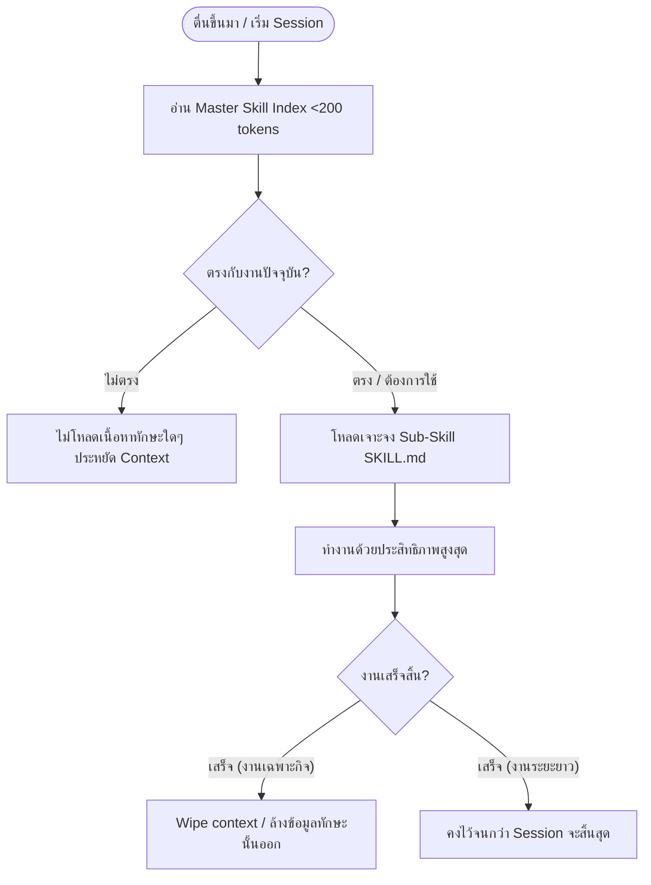

# 🛠️ α ALPHA SKILL SYSTEM

ระบบ **Skill System** ใน Alpha คือกลไกการสืบค้นและดึงข้อมูลทักษะการเขียนโค้ด (Coding Skills) เฉพาะด้านมาใช้งานตามความต้องการจริง (**On-Demand Loading**) เพื่อแก้ปัญหา **Context Window Bloat** และลดการใช้ Token ของ AI Agent ให้เหลือน้อยที่สุด

---

## 📖 1. ความหมายเชิงสถาปัตยกรรม (Architecture Meaning)

ในระบบทั่วไป AI มักจะโหลดคู่มือการเขียนโค้ด เทมเพลต และวิธีแก้ไขปัญหาทั้งหมดเข้ามาในบริบทตั้งแต่เริ่มต้น ซึ่งทำให้เกิดความสูญเสีย Token โดยใช่เหตุ และก่อให้เกิด "เสียงรบกวน" (Noise) ในการประมวลผล

**Alpha Skill System** ใช้หลักการแบบ **Index-Only / Minimalist Loading** โดยแบ่งทักษะออกเป็น 3 ระดับ:
1. **Master Skill Index (`α/skills/SKILL.md`)**: ไฟล์ดัชนีขนาดเล็กมาก (<200 Tokens) เก็บเฉพาะ **ชื่อทักษะ (Skill Name), คำอธิบายย่อ (Description), แท็ก (Tags) และเส้นทางอ้างอิง (Reference Path)**
2. **Sub-Skill Directory (`α/skills/[skill-name]/`)**: โฟลเดอร์แยกตามความเชี่ยวชาญ (เช่น `auth`, `data`, `ui`)
3. **Sub-Skill Details (`α/skills/[skill-name]/SKILL.md`)**: คู่มือเชิงลึกและเทมเพลตโครงสร้างโค้ด ซึ่ง AI จะเปิดอ่านเฉพาะเมื่อมีคำสั่งระบุเจาะจง หรือเมื่อเจองานที่ต้องการทักษะนั้นจริงเท่านั้น



---

## 🚀 2. วิธีการใช้งานสำหรับ AI Agent (Usage Instructions)

เพื่อให้ระบบนี้ทำงานได้สมบูรณ์ AI Agent ต้องปฏิบัติตาม **SKILL PROTOCOL** ใน `α/rules/skill.md` อย่างเคร่งครัด:

1. **ห้ามโหลดโดยอัตโนมัติ (Anti-Autoload)**: ห้ามโหลดไฟล์หรือสแกนไฟล์ย่อยในโฟลเดอร์ `α/skills/` โดยเด็ดขาด
2. **ตรวจ Intent & Match แท็ก**:
   - วิเคราะห์ความต้องการของผู้ใช้ในเทิร์นแรก
   - จับคู่คำสำคัญกับแท็กใน `α/skills/SKILL.md`
3. **อ่านทักษะแบบเจาะจง (On-Demand Fetch)**:
   - ใช้คำสั่ง `view_file` หรือระบบ `rtk read` อ่านข้อมูลจากไฟล์ย่อยเจาะจงเส้นทาง เช่น `file:///Users/neo/Programming/SSJ/cockpit-new/α/skills/auth/SKILL.md`
4. **การบริหารบริบทชั่วคราว (Context Lifecycle)**:
   - สำหรับงานเฉพาะกิจ (Short-lived task): หลังทำภารกิจสำเร็จ ให้ Reset/Forget ข้อมูลนั้นออก
   - สำหรับงานต่อเนื่อง (Long-running session): คงข้อมูลทักษะไว้เพื่อใช้ซ้ำจนกว่าบริบทจะใกล้เต็ม จากนั้นค่อยล้างข้อมูล

---

## 🏗️ 3. วิธีการสร้างโมดูลทักษะใหม่ (Creation Methods)

เมื่อระบบต้องการทักษะใหม่ เช่น ระบบการจัดการคิวงาน (Job Queue) หรือปัญญาประดิษฐ์ในตัว (Local AI) ให้ดำเนินการสร้างโฟลเดอร์และไฟล์โครงสร้าง ดังนี้:

### ขั้นตอนที่ 1: สร้างโฟลเดอร์สำหรับทักษะนั้นๆ
สร้างโฟลเดอร์ย่อยภายใต้ `α/skills/`
```bash
mkdir -p α/skills/queue
```

### ขั้นตอนที่ 2: สร้างไฟล์รายละเอียดทักษะย่อย `SKILL.md`
สร้างไฟล์ `α/skills/[new-skill]/SKILL.md` พร้อมกำหนด **YAML Frontmatter** และเนื้อหาตามเทมเพลตมาตรฐานนี้:

```markdown
---
name: job-queue
description: การจัดการคิวงานพื้นหลังด้วย BullMQ และ Redis
tags: [redis, bullmq, queue, background-jobs, worker]
---

# 🚀 Job Queue Skill (BullMQ & Redis)

## 📌 Best Practices
- ใช้ Redis Connection เดียวกันสำหรับทุก Queue
- จัดการ Error handling เสมอเพื่อป้องกัน Memory leaks

## 🛠️ Code Reference & Template
```typescript
import { Queue } from 'bullmq';
const myQueue = new Queue('paint-jobs');
```
```

---

## ➕ 4. วิธีการเพิ่มทักษะเข้าสู่ระบบ (Addition Methods)

เมื่อสร้างโฟลเดอร์และไฟล์ทักษะย่อยเรียบร้อยแล้ว ต้องทำการ **ลงทะเบียน (Register)** ทักษะนั้นกับตัวระบบเพื่อความสามารถในการมองเห็น (Discoverability):

1. **ลงทะเบียนใน Master Index**:
   เปิดไฟล์ `/Users/neo/Programming/SSJ/cockpit-new/α/skills/SKILL.md` และเพิ่มรายการใหม่ลงในส่วนของ `🗂️ SKILL INDEX MAP` ตามรูปแบบมาตรฐาน:
   ```markdown
   - **queue**: [redis, bullmq, background-jobs] → `skills/queue/SKILL.md`
   ```

2. **ระบุรายละเอียดทักษะใน `STRUCTURE.md`**:
   ไปที่ไฟล์ `α/STRUCTURE.md` เพื่อลงทะเบียนโฟลเดอร์ใหม่ไว้ในหมวดหมู่ `/skills/` เพื่อให้ภาพรวมระบบสอดคล้องกัน

---

## ✏️ 5. วิธีการแก้ไขและดูแลรักษาทักษะ (Editing & Maintenance Methods)

เพื่อรักษาประสิทธิภาพและความประหยัด Token สูงสุด การอัปเดตหรือแก้ไขทักษะควรทำตามแนวทางต่อไปนี้:

### กฎการแก้ไขเนื้อหา:
- **เน้นความกระชับ (Keep it Dense)**: ห้ามใส่คำอธิบายอารัมภบทหรือเนื้อหาที่ฟุ่มเฟือย ให้ใช้โค้ดตัวอย่างที่สมบูรณ์และคู่มือสั้นๆ เป็นหลัก
- **ใช้ Standard Markdown Link เท่านั้น**: สำหรับการเชื่อมโยงทักษะข้ามระบบ ให้ระบุตำแหน่งลิงก์แบบสมบูรณ์ เช่น `[Data Layer Specification](file:///Users/neo/Programming/SSJ/cockpit-new/α/skills/data/SKILL.md)` เพื่อให้อ่านต่อได้สะดวก
- **ห้ามใส่ Source Code ขนาดใหญ่**: ถ้าโค้ดเทมเพลตมีความยาวมากกว่า 100 บรรทัด ให้เก็บโค้ดไว้ใน `α/scripts/` หรือ `α/tools/` แล้วเขียนลิงก์อ้างอิงตำแหน่งไฟล์ปลายทางลงในทักษะแทนการแปะทับลงตรงๆ

### ขั้นตอนการอัปเดต:
1. ปรับปรุงรายละเอียดในไฟล์ทักษะย่อย (`α/skills/[name]/SKILL.md`)
2. หากมีการเปลี่ยนแปลงประเภทเทคโนโลยีหรือไลบรารี ให้เข้าไปอัปเดต **Tags** ใน YAML Frontmatter ของทักษะย่อย
3. เข้ามาปรับปรุงตัวช่วยจำแท็กใน Master Index (`α/skills/SKILL.md`) เพื่อให้สอดคล้องกัน
4. รันคำสั่ง `alpha --memo-sync` เพื่อให้ความทรงจำและกราฟความสัมพันธ์ในโปรเจกต์อัปเดตตาม
